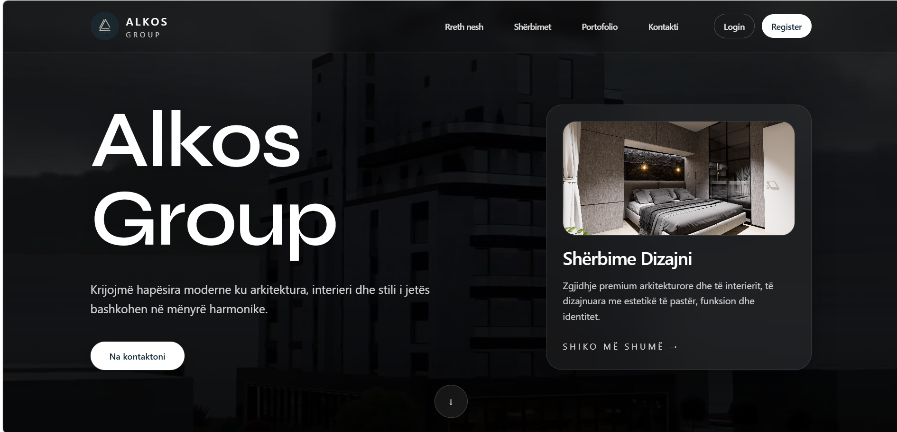
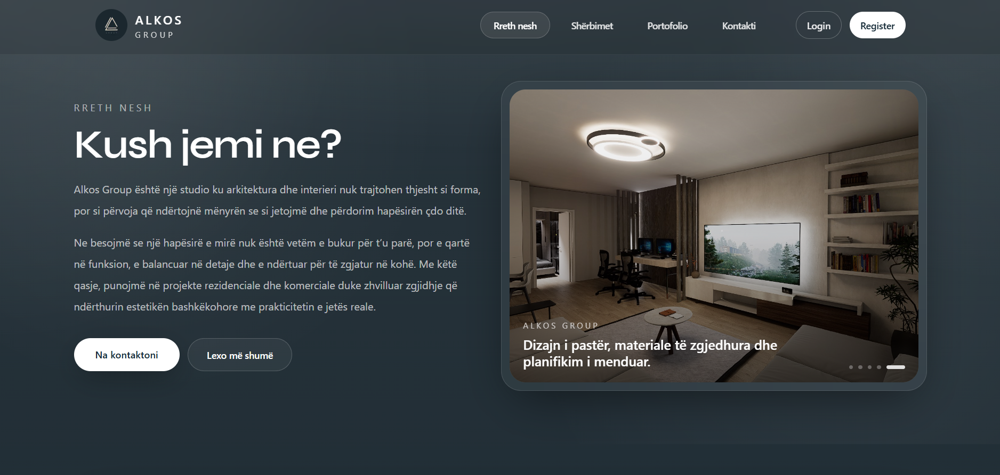
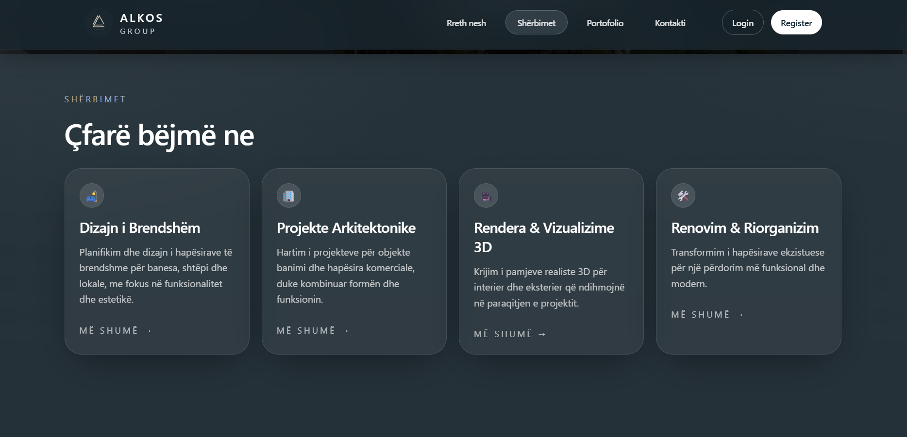
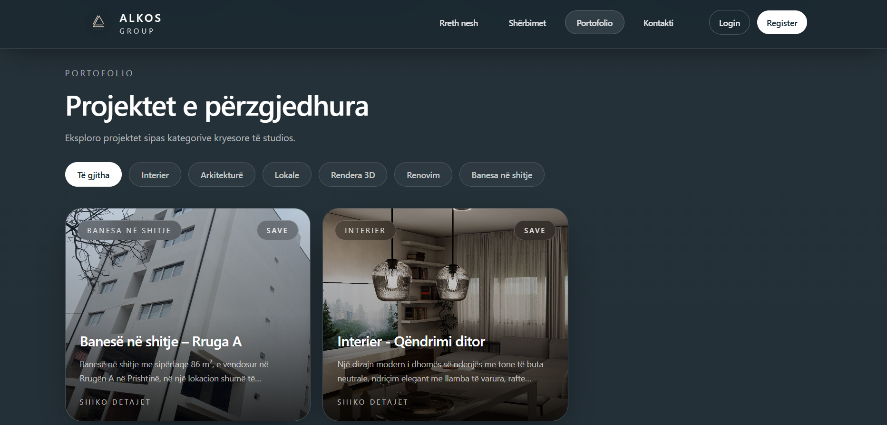
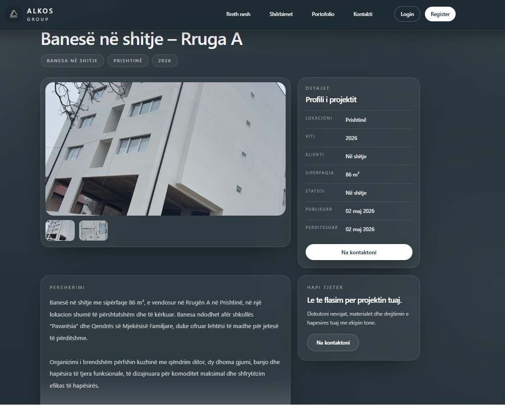
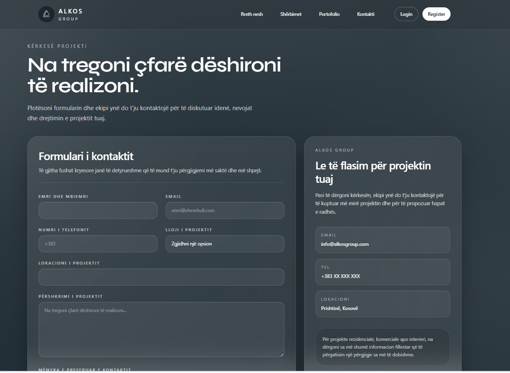
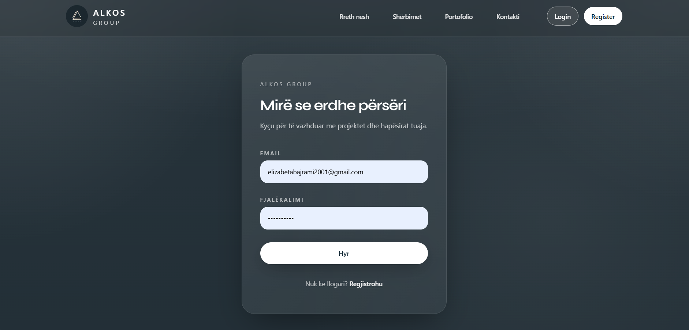
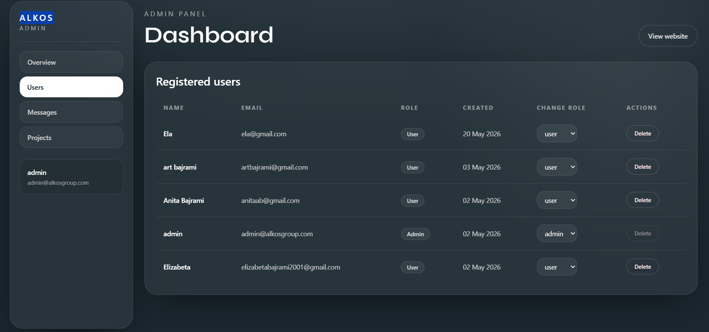

# Architecture Studio Web Platform

## Përshkrimi i Projektit

Architecture Studio Web Platform është një aplikacion modern web i zhvilluar për një studio arkitekture dhe interior design. Platforma mundëson prezantimin e kompanisë, shërbimeve dhe projekteve të realizuara, si dhe menaxhimin e përmbajtjes përmes një admin dashboard.

Përdoruesit mund të eksplorojnë portofolion, të shohin detajet e projekteve, të krijojnë llogari, të ruajnë projektet e preferuara dhe të kontaktojnë kompaninë përmes formularëve interaktivë.

---

# Funksionalitetet Kryesore

- Home page moderne dhe responsive
- Navbar interaktive me smooth scrolling
- Login & Register me autentifikim
- Role-based authentication (Admin / User)
- Admin Dashboard
- Portfolio dinamike
- Dynamic Project Details pages
- Favorites system
- Contact Form
- Profile page
- Responsive Design
- Glassmorphism UI Design
- CRUD operacione për projekte
- MongoDB integration
- Testing me Jest & React Testing Library

---

# Teknologjitë e Përdorura

- Next.js
- TypeScript
- Tailwind CSS
- MongoDB
- NextAuth
- React Hook Form
- Framer Motion
- Jest
- React Testing Library

---

# Data Fetching

Në projekt janë përdorur teknikat e mëposhtme të Next.js:

- `getStaticProps`
- `getStaticPaths`
- `getServerSideProps`
- `ISR (Incremental Static Regeneration)`
- `revalidate`

---

# Instalimi i Projektit

## 1. Clone repository

```bash
git clone <repository-link>
```

## 2. Hyr në projekt

```bash
cd architecture-studio-web
```

## 3. Instalo dependencies

```bash
npm install
```

## 4. Starto projektin

```bash
npm run dev
```

Aplikacioni hapet në:

```bash
http://localhost:3000
```

---

# Environment Variables

Krijoni file:

```bash
.env
```

Shembull:

```env
MONGODB_URI=your_mongodb_connection
NEXTAUTH_SECRET=your_secret
NEXTAUTH_URL=http://localhost:3000
JWT_SECRET=your_jwt_secret
```

---

# Testing

Për testim përdoret Jest dhe React Testing Library.

Run tests:

```bash
npm test
```

Projekti përmban:

- 3 component tests
- 2 API route tests

---

# Build Production

```bash
npm run build
```

---

# Struktura e Projektit

```bash
src/
 ├── components/
 ├── pages/
 ├── sections/
 ├── context/
 ├── hooks/
 ├── styles/
 ├── lib/
 └── data/

backend/
 ├── models/
 ├── routes/
 ├── middleware/
 └── config/
```

---

# Faqet Kryesore

- Home
- About
- Contact
- Login
- Register
- Profile
- Portfolio
- Project Details
- Admin Dashboard

---

# Rrjedha e Autentifikimit

- User login/register
- JWT authentication
- Role checking
- Admin route protection
- Favorites management
- Protected dashboard access

---

# Team Members

- Elizabeta Bajrami
- Laura
- Vlera
- Blenda

---

# Ndarja e Punës

### Elizabeta Bajrami

- Frontend UI/UX
- Home page
- Navbar interactions
- Glassmorphism design
- Responsive layout
- Animations

### Laura

- Authentication
- Login/Register
- NextAuth integration

### Vlera

- Portfolio system
- Dynamic project pages
- Favorites functionality

### Blenda

- Contact forms
- Admin dashboard
- Request management

---

# Deployment

Projekti është deployuar në Vercel.
https://architecture-studio-web-pi.vercel.app/

---

# Screenshots

## Home Page



## About Us



## Services



## Portfolio



## Project Details



## Contact Page



## Login Page



## Admin Dashboard



---

# Përmirësime të Ardhshme

- Google Authentication
- Dark/Light mode
- Advanced filtering
- Real-time notifications
- Project search system
- Image optimization improvements

---

# Përfundim

Ky projekt demonstron zhvillimin e një aplikacioni modern web me Next.js dhe Tailwind CSS, duke implementuar autentifikim, role management, dynamic routing, data fetching methods, CRUD operacione, responsive design dhe praktika moderne të frontend development.
